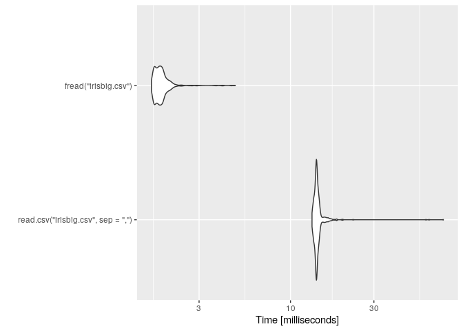

Pour comparer la vitesse de 2 bouts de codes (ou plus que 2), on utilise
le package rbenchmark.

La structure générale est la suivante :

``` r
library(rbenchmark)

benchmark(replications=100,
          code1,
          code2,
          columns=c('test', 'elapsed', 'replications'))
```

Et avec un exemple :

``` r
library(rbenchmark)
library(data.table)

# Ecriture d'un fichier de 15000 lignes 
data(iris)
iris <- iris[rep(rownames(iris), each=100),]
fwrite(iris, file="irisbig.csv", sep=",")

# Lecture du fichier, répétée 1000 fois. 
benchmark(replications=1000,
          read.csv("irisbig.csv", sep=","),
          fread("irisbig.csv"),
          columns=c('test', 'elapsed', 'replications'))
```

    ##                                 test elapsed replications
    ## 2               fread("irisbig.csv")   1.980         1000
    ## 1 read.csv("irisbig.csv", sep = ",")  14.069         1000

Le test2, utilisant la fonction `fread` du package `data.table` est bien
plus rapide.

De la même manière on peut utiliser le package microbenchmark qui a
l’avantage d’avoir une belle visualisation avec ggplot2 :

``` r
library(microbenchmark)
library(ggplot2)
rm(test1)
```

    ## Warning in rm(test1): objet 'test1' introuvable

``` r
rm(test2)
```

    ## Warning in rm(test2): objet 'test2' introuvable

``` r
# Lecture du fichier, répétée 1000 fois. 
mb <- microbenchmark(
          read.csv("irisbig.csv", sep=","),
          fread("irisbig.csv"),
          times=1000)

mb
```

    ## Unit: milliseconds
    ##                                expr       min        lq      mean    median
    ##  read.csv("irisbig.csv", sep = ",") 13.361997 13.754532 14.385080 13.999627
    ##                fread("irisbig.csv")  1.586168  1.650656  1.818022  1.755421
    ##         uq       max neval cld
    ##  14.356337 73.857086  1000   b
    ##   1.858666  4.827518  1000  a

``` r
autoplot(mb)
```

    ## Coordinate system already present. Adding new coordinate system, which will replace the existing one.

<!-- -->
