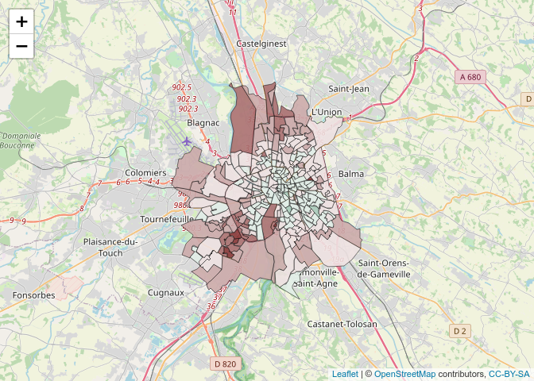

## Benchmarking

Pour comparer la vitesse de 2 bouts de codes (ou plus que 2), on utilise
le package rbenchmark.

La structure générale est la suivante :

``` r
library(rbenchmark)

benchmark(replications=100,
          code1,
          code2,
          columns=c('test', 'elapsed', 'replications'))
```

Et avec un exemple :

``` r
library(rbenchmark)
library(data.table)

# Ecriture d'un fichier de 15000 lignes 
data(iris)
iris <- iris[rep(rownames(iris), each=100),]
fwrite(iris, file="irisbig.csv", sep=",")

# Lecture du fichier, répétée 1000 fois. 
benchmark(replications=rep(1000),
          test1 <- read.csv("irisbig.csv", sep=","),
          test2 <- fread("irisbig.csv"),
          columns=c('test', 'elapsed', 'replications'))
```

    ##                                          test elapsed replications
    ## 1 test1 <- read.csv("irisbig.csv", sep = ",")  13.799         1000
    ## 2               test2 <- fread("irisbig.csv")   1.863         1000

Le test2, utilisant la fonction `fread` du package `data.table` est bien
plus rapide.

## Faire une carte avec R (et leaflet)

Pour faire une carte (ici des polygones), il faut des données, et un
fond de carte correspondant.

On va prendre pour l’exemple le résultats au second tour des élections
municipales 2020 à Toulouse, par bureau de vote.

On charge le résultat des élections :

``` r
votes <- read.csv("https://data.toulouse-metropole.fr/explore/dataset/elections-municipales-et-communautaires-2020-2eme-tour-toulouse-resultats/download/?format=csv&timezone=Europe/Berlin&lang=fr&use_labels_for_header=true&csv_separator=%3B", sep=";", stringsAsFactors = F)
head(votes, 10)
```

    ##    Numéro Type.election Annee Type.enregistrement Numéro.tour Code.departement
    ## 1       2            MN  2020                   V           2               31
    ## 2       7            MN  2020                   V           2               31
    ## 3      13            MN  2020                   V           2               31
    ## 4      19            MN  2020                   V           2               31
    ## 5      23            MN  2020                   V           2               31
    ## 6      25            MN  2020                   V           2               31
    ## 7      29            MN  2020                   V           2               31
    ## 8      32            MN  2020                   V           2               31
    ## 9      39            MN  2020                   V           2               31
    ## 10     41            MN  2020                   V           2               31
    ##    Code.commune Numéro.bdv Indicatif Inscrits Abstentions Votants
    ## 1           555          2         I      901         425     476
    ## 2           555          7         I      825         354     471
    ## 3           555         13         I      990         489     501
    ## 4           555         19         I      798         391     407
    ## 5           555         23         I      997         526     471
    ## 6           555         25         I      899         471     428
    ## 7           555         29         I     1066         565     501
    ## 8           555         32         I      882         381     501
    ## 9           555         39         I       85          47      38
    ## 10          555         41         I      778         423     355
    ##    Votants.emargement Blancs Nuls Exprimes Nombre.de.listes Archipel.Citoyen
    ## 1                 475      1    0      475                2               14
    ## 2                 471      4    1      466                2               14
    ## 3                 501      5    1      495                2               14
    ## 4                 407      6    4      397                2               14
    ## 5                 471     10    6      455                2               14
    ## 6                 428     10    1      417                2               14
    ## 7                 501      8    5      488                2               14
    ## 8                 501      4    8      489                2               14
    ## 9                  38      0    0       38                2               14
    ## 10                355      4    3      348                2               14
    ##    Nombre.de.voix.de.la.liste...Archipel.Citoyen
    ## 1                                            245
    ## 2                                            149
    ## 3                                            256
    ## 4                                            230
    ## 5                                            244
    ## 6                                            257
    ## 7                                            293
    ## 8                                            117
    ## 9                                             19
    ## 10                                           135
    ##    Aimer.Toulouse.avec.Jean.Luc.Moudenc
    ## 1                                    10
    ## 2                                    10
    ## 3                                    10
    ## 4                                    10
    ## 5                                    10
    ## 6                                    10
    ## 7                                    10
    ## 8                                    10
    ## 9                                    10
    ## 10                                   10
    ##    Nombre.de.voix.de.la.liste...Aimer.Toulouse
    ## 1                                          230
    ## 2                                          317
    ## 3                                          239
    ## 4                                          167
    ## 5                                          211
    ## 6                                          160
    ## 7                                          195
    ## 8                                          372
    ## 9                                           19
    ## 10                                         213

``` r
votes$Pct_abstention <- votes$Abstentions/votes$Inscrits
votes <- votes[,c("Numéro.bdv", "Pct_abstention")]
is.character(votes$Numéro.bdv)
```

    ## [1] TRUE

Je ne garde que les colonnes qui m’intéressent : le numéro de bureau de
vote pour faire le lien avec le fond de carte, et le pourcentage
d’abstention. Je m’assure que le numéro de bureau de vote est du
character (pour pouvoir fusionner avec le découpage des bureaux de vote,
j’ai besoin qu’ils soient au même format).

La colonne qui va nous intéresser est la colonne "Numéro.bdv On charge
le fond de carte (découpage) des bureaux de vote :

``` r
library(geojsonio)
```

    ## 
    ## Attaching package: 'geojsonio'

    ## The following object is masked from 'package:base':
    ## 
    ##     pretty

``` r
library(curl)

tmp <- tempfile()
tmp <- paste0(tmp, ".geojson")
curl_download("https://data.toulouse-metropole.fr/explore/dataset/elections-2020-decoupage-bureaux-de-vote-toulouse/download/?format=geojson&timezone=Europe/Berlin&lang=fr", tmp)
bureaux <- geojson_read(tmp, what = "sp")

head(bureaux@data, 10)
```

    ##                               nom                  adresse uniq_bdv bv2020
    ## 1  CAPITOLE SALLE DES COMMISSIONS           HOTEL DE VILLE     0001      1
    ## 2                   ECOLE LAKANAL      17 PL DE LA DAURADE     0004      4
    ## 3               ECOLE JEAN JAURES         21 AVENUE FRIZAC     0052     52
    ## 4             ECOLE PIERRE DUPONT 101 GRANDE RUE ST MICHEL     0056     56
    ## 5                    ECOLE BAYARD          60 RUE MATABIAU     0015     15
    ## 6                 ECOLE SAUZELONG 92 AVENUE ALBERT BEDOUCE     0065     65
    ## 7          ECOLE MAURICE JACQUIER          7 RUE DU POITOU     0086     86
    ## 8        GROUPE SCOLAIRE BONHOURE  20 B PLACE MARIUS PINEL     0045     45
    ## 9                ECOLE LESPINASSE       3 RUE DU CHAIREDON     0142    142
    ## 10                  ECOLE MOLIERE      36 RUE SAINTE LUCIE     0115    115
    ##              geo_point
    ## 1  43.603224, 1.444108
    ## 2  43.601220, 1.438943
    ## 3    43.59357, 1.45537
    ## 4  43.587472, 1.445441
    ## 5  43.610084, 1.447426
    ## 6    43.57660, 1.45892
    ## 7  43.575600, 1.413931
    ## 8  43.605947, 1.468468
    ## 9  43.595169, 1.434961
    ## 10 43.588051, 1.428404

Ici j’ai préféré convertir le geojson téléchargé en
`SpatialPolygonDataFrame` pour pouvoir manipuler facilement les données
associées au fond de carte, mais c’est plus lourd en mémoire que le
geojson, notamment au moment de la représentation.

La colonne qui nous intéresse pour faire la jointure est `bv2020`. On
s’assure qu’elle est bien en character, et on rappatrie le pourcentage
d’abstention dans les données du fond de carte.

``` r
is.character(bureaux@data$bv2020)
```

    ## [1] TRUE

``` r
bureaux@data <- merge(bureaux@data, votes, by.x="bv2020", by.y="Numéro.bdv", all=T, sort=F)
```

**Attention dans le merge ci-dessus, le `sort=F` est primordial** pour
ne pas retrier les données avec la colonne `bv2020` lors du merge. Si le
tri est fait, les objects `bureaux@data` et `bureaux@polygons` ne seront
pas triès de la même façon, et ne correspondront donc pas, on aura les
bons polygones mais pas les bonnes donénes dessus.

On peut maintenant faire la carte :

``` r
library(leaflet)

# Pour la palette
binsmap <- c(0, 0.1, 0.2, 0.3, 0.4, 0.5, 0.6, 0.7, 0.8, 0.9, Inf)
pal <- colorBin(colorRamp(c("#006633", "#FFFFFF", "#660000")), domain = c(0,1), bins = binsmap)

m <- leaflet(bureaux) %>%
  addTiles() %>% 
  addPolygons(fillColor = ~pal(Pct_abstention), 
              color="black", 
              weight = 0.5, 
              opacity = 1, 
              fillOpacity=0.9,
              highlight = highlightOptions(weight = 4,
                                           fillOpacity = 1,
                                           bringToFront = TRUE))
m
```

<!-- -->

En ajoutant des labels :

``` r
# Création des labels :

labels <- sprintf(
  "<strong>%s</strong>, BDV %s<br/> %g Abstention<br/>",
  bureaux$nom, bureaux$bv2020, round(100*bureaux$Pct_abstention,2)
) %>% lapply(htmltools::HTML)

bureaux@data$labelsmap <- labels

binsmap <- c(0, 0.1, 0.2, 0.3, 0.4, 0.5, 0.6, 0.7, 0.8, 0.9, Inf)
pal <- colorBin(colorRamp(c("#006633", "#FFFFFF", "#660000")), domain = c(0,1), bins = binsmap)

m <- leaflet(bureaux) %>%
  addTiles() %>% 
  addPolygons(fillColor = ~pal(Pct_abstention), 
              color="black", 
              weight = 0.5, 
              opacity = 1, 
              fillOpacity=0.9,
              highlight = highlightOptions(weight = 4,
                                           fillOpacity = 1,
                                           bringToFront = TRUE),
              label = bureaux$labelsmap,
              labelOptions = labelOptions(
                style = list("font-weight" = "normal", padding = "3px 8px"),
                textsize = "8px",
                direction = "auto"))
m
```

<!-- -->
