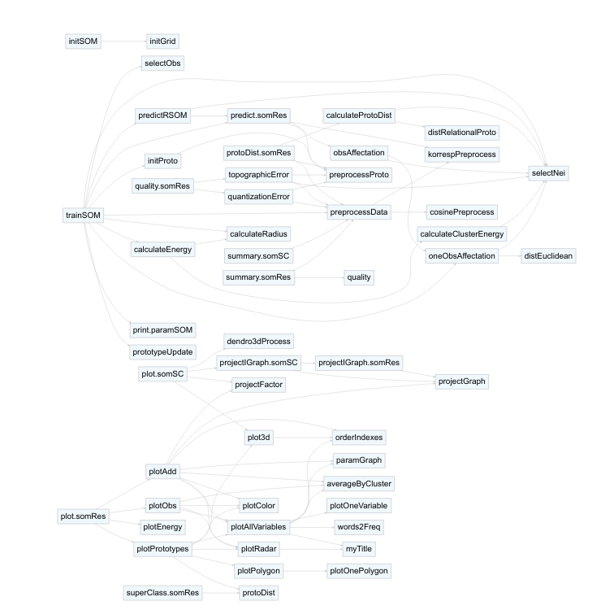

Le code qui suit, écrit par [Carl B
Frederik](https://www.carlbfrederick.com/post/uncovering-the-relationships-among-functions-in-a-package/)
permet de tracer les relations entre les fonctions d’un package.

J’ai légèrement modifié sa fonction car ça me retourne une erreur, en
ajoutant les lignes suivantes dans la fonction `scan_fcn`.

``` r
  if(is.infinite(start) | is.infinite(stop)){
    start <- 0
    stop <- 0
  }
```

Nb. Le code de l’article de blog a évolué depuis, le courant est sur son
gist :
<https://gist.github.com/carlbfrederick/b30d861ea80a27fad4e44623c41e0170>

## R Markdown

``` r
library(tidyverse)
```

    ## ── Attaching packages ───────────────────────────────────────────────────────────────────────── tidyverse 1.3.0 ──

    ## ✓ ggplot2 3.3.1     ✓ purrr   0.3.4
    ## ✓ tibble  3.0.1     ✓ dplyr   1.0.0
    ## ✓ tidyr   1.1.0     ✓ stringr 1.4.0
    ## ✓ readr   1.3.1     ✓ forcats 0.5.0

    ## ── Conflicts ──────────────────────────────────────────────────────────────────────────── tidyverse_conflicts() ──
    ## x dplyr::filter() masks stats::filter()
    ## x dplyr::lag()    masks stats::lag()

``` r
library(DiagrammeR)

#Get package functions ----

ls_fcns <- function(pkg) {
  fcns <- unclass(lsf.str(envir = asNamespace(pkg), all = TRUE))
  return(as.character(fcns))
}

#Utility Function to weed out false positives
scan_fcn <- function(from, to) {
  this_fcn <- trimws(capture.output(getAnywhere(from)), which = "both")
  #subset to guts of function definition
  start <- min(grep("^function", this_fcn)) + 1
  stop <- max(grep("^}", this_fcn)) - 1
  if(is.infinite(start) | is.infinite(stop)){
    start <- 0
    stop <- 0
  }
  this_fcn <- this_fcn[start:stop]
  
  #Remove comment lines
  this_fcn <- this_fcn[!grepl("^#", this_fcn)]  
  
  #Lines called functions directly
  idx1 <- grepl(paste(to, "\\(", sep=""), this_fcn)
  
  #Lines called via *map*, *walk*, mutate_at/all, summarize_at/all, *apply
  idx2 <- grepl(to, this_fcn) & 
    (grepl("summari[sz]e\\_(all)?(if)?(at)?\\(", this_fcn) | 
       grepl("(trans)?mute?(ate)?\\_(all)?(if)?(at)?\\(", this_fcn) | 
       grepl("[lp]?map2?(\\_if)?(\\_at)?(\\_lgl)?(\\_chr)?(\\_int)?(\\_dbl)?(\\_raw)?(\\_dfr)?(\\_dfc)?(\\_depth)?\\(", this_fcn) |
       grepl("p?walk2?\\(", this_fcn) | 
       grepl("[ltsmvr]?apply\\(", this_fcn))
  
  sum(idx1 | idx2)
}


#Search for other package functions called by function

fcn_deps <- function(pkg) {
  fcns <- ls_fcns(pkg)
  
  out <- tibble(
    Function = fcns, 
    Dependency_Function = fcns
  ) %>% 
    expand(Function, Dependency_Function) %>% 
    filter(Function != Dependency_Function) %>% 
    mutate(
      Number_Calls = map2_int(Function, Dependency_Function, scan_fcn)
    ) %>% 
    filter(Number_Calls > 0)
  
  return(out)
}


plotFcnDependencies <- function(pkg) {
  fcns <- ls_fcns(pkg)
  depFcn <- fcn_deps(pkg)
  
  depth <- NULL
  
  nodes <- create_node_df(n = length(fcns),
                          label = fcns,
                          type = "",
                          fontsize = 20,
                          shape = "rectangle")
  
  nodes$id <- 1:nrow(nodes)
  
  edges <- data.frame(fromLab = depFcn$Function,
                      toLab = depFcn$Dependency_Function,
                      stringsAsFactors = FALSE)
  
  edges <- nodes %>% 
    select(from = id, fromLab = label) %>% 
    right_join(edges, by="fromLab")
  
  edges <- nodes %>% 
    select(to = id, toLab = label) %>% 
    right_join(edges, by="toLab") %>% 
    mutate(rel = "") %>% 
    select(from, to, rel, fromLab, toLab)
  library(tidyverse)
  library(DiagrammeR)
  
  #Get package functions ----
  
  ls_fcns <- function(pkg) {
    fcns <- unclass(lsf.str(envir = asNamespace(pkg), all = TRUE))
    return(as.character(fcns))
  }
  
  #Utility Function to weed out false positives
  scan_fcn <- function(from, to) {
    this_fcn <- trimws(capture.output(getAnywhere(from)), which = "both")
    #subset to guts of function definition
    start <- min(grep("^function", this_fcn)) + 1
    stop <- max(grep("^}", this_fcn)) - 1
    if(is.infinite(start) | is.infinite(stop)){
      start <- 0
      stop <- 0
    }
    this_fcn <- this_fcn[start:stop]
    
    #Remove comment lines
    this_fcn <- this_fcn[!grepl("^#", this_fcn)]  
    
    #Lines called functions directly
    idx1 <- grepl(paste(to, "\\(", sep=""), this_fcn)
    
    #Lines called via *map*, *walk*, mutate_at/all, summarize_at/all, *apply
    idx2 <- grepl(to, this_fcn) & 
      (grepl("summari[sz]e\\_(all)?(if)?(at)?\\(", this_fcn) | 
         grepl("(trans)?mute?(ate)?\\_(all)?(if)?(at)?\\(", this_fcn) | 
         grepl("[lp]?map2?(\\_if)?(\\_at)?(\\_lgl)?(\\_chr)?(\\_int)?(\\_dbl)?(\\_raw)?(\\_dfr)?(\\_dfc)?(\\_depth)?\\(", this_fcn) |
         grepl("p?walk2?\\(", this_fcn) | 
         grepl("[ltsmvr]?apply\\(", this_fcn))
    
    sum(idx1 | idx2)
  }
  
  
  #Search for other package functions called by function
  
  fcn_deps <- function(pkg) {
    fcns <- ls_fcns(pkg)
    
    out <- tibble(
      Function = fcns, 
      Dependency_Function = fcns
    ) %>% 
      expand(Function, Dependency_Function) %>% 
      filter(Function != Dependency_Function) %>% 
      mutate(
        Number_Calls = map2_int(Function, Dependency_Function, scan_fcn)
      ) %>% 
      filter(Number_Calls > 0)
    
    return(out)
  }
  
  
  plotFcnDependencies <- function(pkg) {
    fcns <- ls_fcns(pkg)
    depFcn <- fcn_deps(pkg)
    
    depth <- NULL
    
    nodes <- create_node_df(n = length(fcns),
                            label = fcns,
                            type = "",
                            fontsize = 20,
                            shape = "rectangle")
    
    nodes$id <- 1:nrow(nodes)
    
    edges <- data.frame(fromLab = depFcn$Function,
                        toLab = depFcn$Dependency_Function,
                        stringsAsFactors = FALSE)
    
    edges <- nodes %>% 
      select(from = id, fromLab = label) %>% 
      right_join(edges, by="fromLab")
    
    edges <- nodes %>% 
      select(to = id, toLab = label) %>% 
      right_join(edges, by="toLab") %>% 
      mutate(rel = "") %>% 
      select(from, to, rel, fromLab, toLab) 
    
    
    
    out <- DiagrammeR::create_graph(
      nodes_df = nodes,
      edges_df = edges,
      graph_name = paste(pkg, " (version ", packageVersion(pkg), ") Function Map", sep="")
    )
    
    out$global_attrs$value[out$global_attrs$attr == "layout"] <- "dot"
    out$global_attrs$value[out$global_attrs$attr == "fixedsize"] <- "false"
    out$global_attrs <- rbind(out$global_attrs, data.frame(attr = "rankdir", value = "LR", attr_type = "graph"))
    
    return(out)
  } 
  
  
  
  out <- DiagrammeR::create_graph(
    nodes_df = nodes,
    edges_df = edges,
    graph_name = paste(pkg, " (version ", packageVersion(pkg), ") Function Map", sep="")
  )
  
  out$global_attrs$value[out$global_attrs$attr == "layout"] <- "dot"
  out$global_attrs$value[out$global_attrs$attr == "fixedsize"] <- "false"
  out$global_attrs <- rbind(out$global_attrs, data.frame(attr = "rankdir", value = "LR", attr_type = "graph"))
  
  return(out)
}
```

Le code se lance comme ça :

``` r
plotdep <- plotFcnDependencies("SOMbrero")
```

``` r
plotdep %>% select_nodes_by_degree(expressions = "deg > 0") %>% transform_to_subgraph_ws %>% render_graph(width = 700, height = 700)
```

<!-- -->
